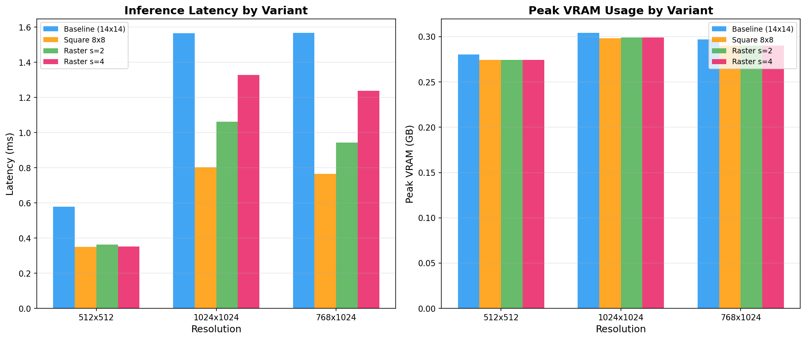

# MambaVision Raster-Attention

## Hypothesis
MambaVision already chops its Stage 3 attention into 14×14 square chunks before doing the expensive math. The idea was that documents aren't square — text runs in horizontal lines — so cutting into horizontal strips instead of squares might be faster or more natural for document images.

## Experiment
Took the real pretrained model (`nvidia/MambaVision-T-1K`), touched only Stage 3, and tried four ways of chunking: 
1. The original 14×14 squares
2. Smaller 8×8 squares
3. Horizontal strips of height 2 (`s=2`)
4. Horizontal strips of height 4 (`s=4`)

Timed each on a T4 GPU at three image sizes (512x512, 1024x1024, 768x1024), using real `torch.cuda.Event` timing with 20 repeated runs to capture mean ± std dev. The similarity check used two public document images from the IAM Handwriting Database and three synthetic text-like tensors.

## Result
Smaller chunks are faster, full stop — that part is unsurprising and expected. The strip idea does not consistently beat squares. At the two bigger, more document-like sizes, plain smaller squares actually won. Strips only won at the smallest size. 

One strip variant (s=4) came in faster than the original despite processing more tokens. Profiling with `torch.profiler` explains this as a side effect of how the padding and window count worked out on the hardware: the 14x14 window padded 1024x1024 up to 70x70 chunks (25 windows total), while s=4 divided perfectly into 16 windows. Inside PyTorch's `fmha_cutlassF_f32_aligned_64x64_rf_sm75` FlashAttention kernel, both sequences rounded up to the same number of hardware tile evaluations per window, so dispatching 16 windows simply took less GPU time than dispatching 25. It is a hardware/padding side effect, not proof strips are structurally better.



### Latency & VRAM (Stage 3 Attention Only)
| Variant              | Resolution | Latency (ms) | Peak VRAM (GB) |
|----------------------|------------|--------------|----------------|
| Baseline (14x14)     | 512x512    | 0.67 ± 0.02  | 0.28           |
| Baseline (14x14)     | 1024x1024  | 1.66 ± 0.14  | 0.31           |
| Baseline (14x14)     | 768x1024   | 1.25 ± 0.03  | 0.30           |
| Square 8x8           | 512x512    | 0.50 ± 0.14  | 0.27           |
| Square 8x8           | 1024x1024  | 0.91 ± 0.06  | 0.30           |
| Square 8x8           | 768x1024   | 0.83 ± 0.05  | 0.29           |
| Raster s=2           | 512x512    | 0.34 ± 0.01  | 0.27           |
| Raster s=2           | 1024x1024  | 1.14 ± 0.01  | 0.30           |
| Raster s=2           | 768x1024   | 1.06 ± 0.02  | 0.29           |
| Raster s=4           | 512x512    | 0.39 ± 0.01  | 0.27           |
| Raster s=4           | 1024x1024  | 1.45 ± 0.08  | 0.30           |
| Raster s=4           | 768x1024   | 1.26 ± 0.04  | 0.29           |

### Similarity Check (Cosine Similarity vs Baseline)
| Image                  | Square-8x8    | Raster-s2    | Raster-s4    |
|------------------------|---------------|--------------|--------------|
| doc_image_0            | 0.864261      | 0.902642     | 0.910414     |
| doc_image_1            | 0.937402      | 0.930655     | 0.930686     |
| synthetic_doc_2        | 0.967734      | 0.736336     | 0.877644     |
| synthetic_doc_3        | 0.962260      | 0.753574     | 0.882435     |
| synthetic_doc_4        | 0.946063      | 0.749009     | 0.866310     |

## Reproduction
```bash
pip install -r requirements.txt
python benchmark_raster_attention.py
```
